模拟特定数量的表结构和字段来测试集成mybatis-plus的启动速度.

测试扫描controller,service,mapper:
串行: java -jar mybatis-plus-startup-analysis-0.0.1-SNAPSHOT.jar
并行: java -jar mybatis-plus-startup-analysis-0.0.1-SNAPSHOT.jar --mybatis.plus.parallel=true

测试只扫描mapper:
串行: java -jar mybatis-plus-startup-analysis-0.0.1-SNAPSHOT.jar --scanpackage=com.baomihua
并行: java -jar mybatis-plus-startup-analysis-0.0.1-SNAPSHOT.jar --mybatis.plus.parallel=true --scanpackage=com.baomihua

实测:

机器: Core(TM) i7-12700H  2.70 GHz  64G 

1000张表, 注入1000 * 12(内置方法)  串行注入启动 16秒 左右 (扫描 controller service mapper)
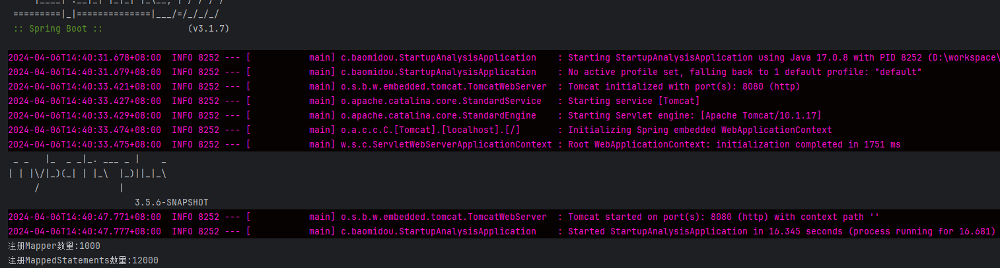
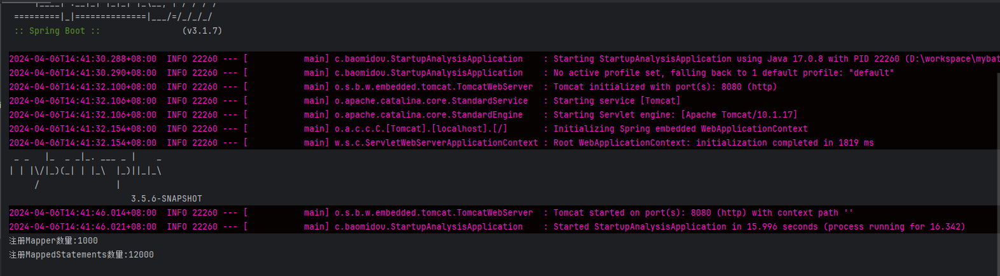
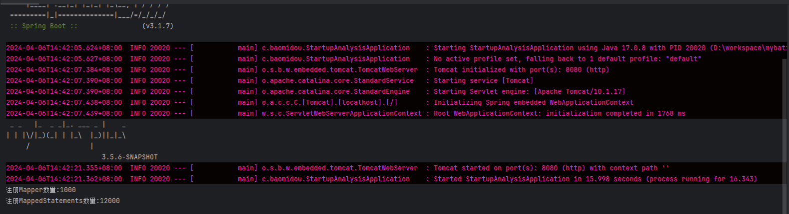

1000张表, 注入1000 * 12(内置方法)  串行注入启动 9秒 左右 (扫描 mapper)
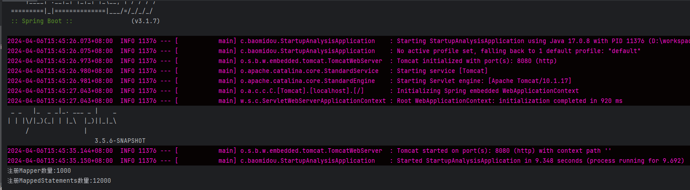
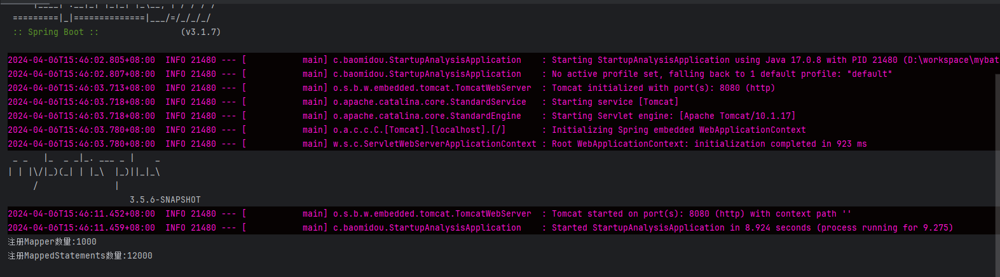
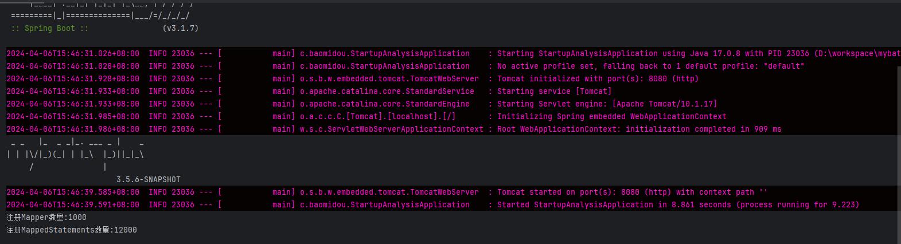

1000张表, 注入1000 * 12(内置方法)  并行注入启动 14秒 左右 (扫描 controller service mapper)
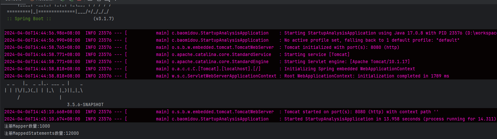
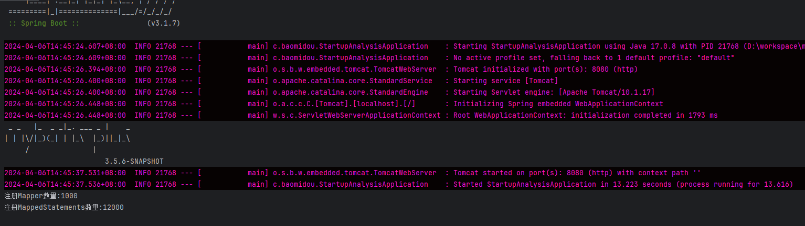
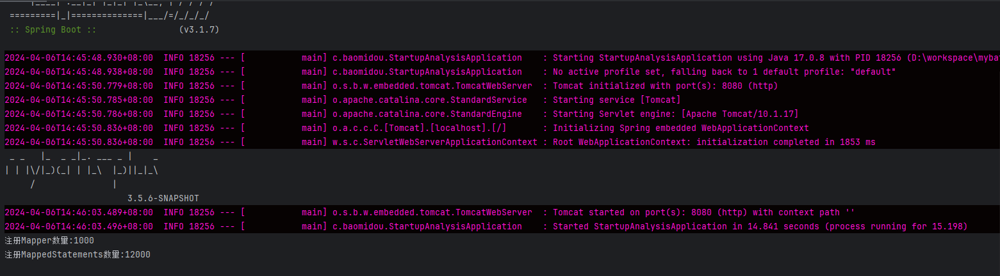

1000张表, 注入1000 * 12(内置方法)  并行注入启动 5.5 秒 左右 (扫描 mapper)

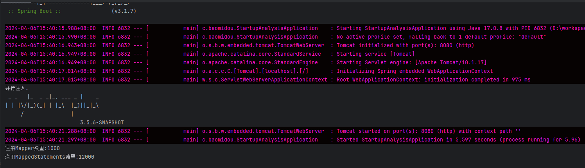
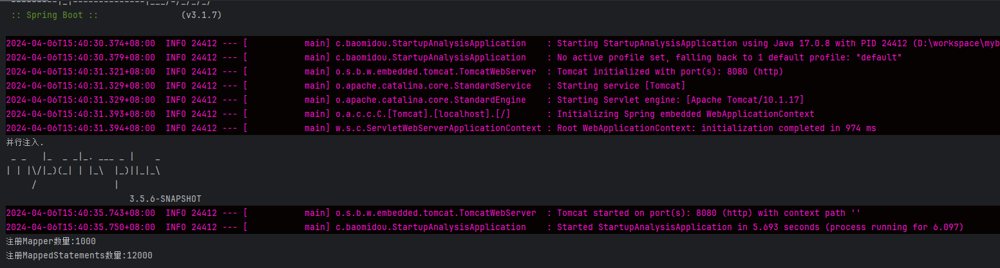
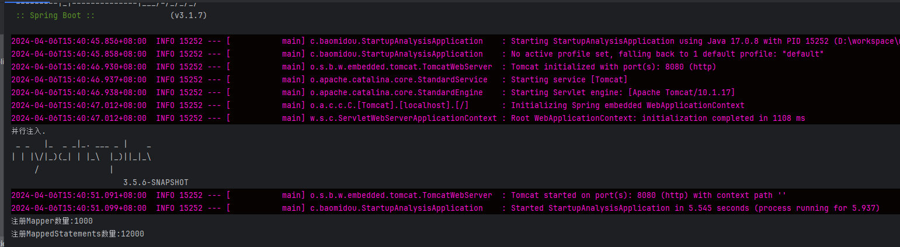

虚拟机 Core(TM) i7-12700H  2H 4G

1000张表, 注入1000 * 12(内置方法)  串行注入启动 31秒 左右 (扫描 controller service mapper)
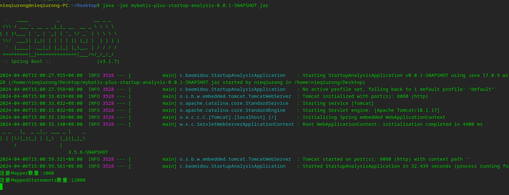
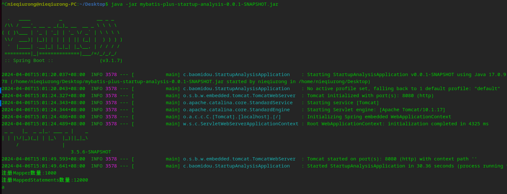
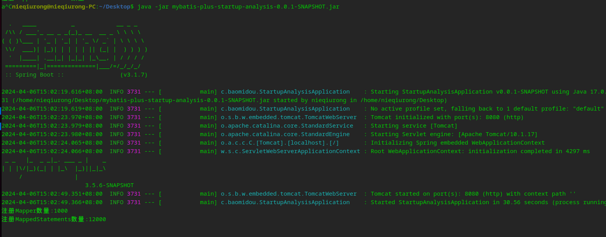

1000张表, 注入1000 * 12(内置方法)  串行注入启动 17秒 左右 (扫描 mapper)
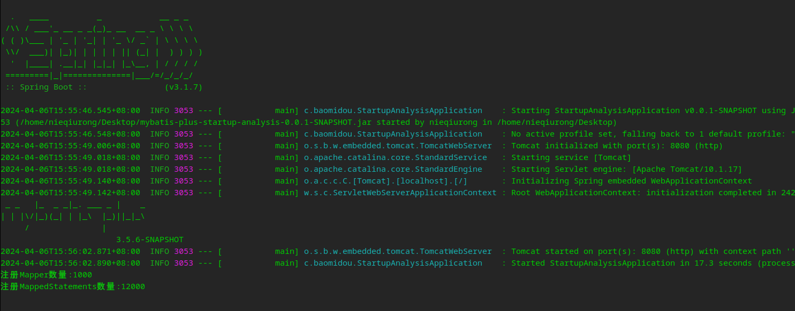
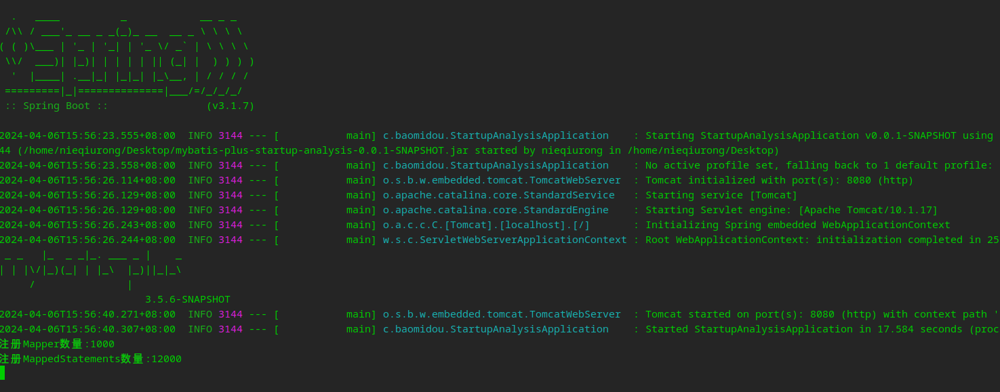
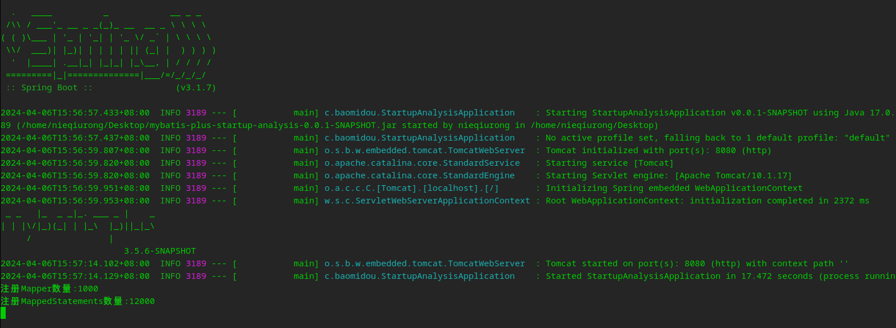

1000张表, 注入1000 * 12(内置方法)  并行注入启动 30秒 左右 (扫描 controller service mapper)
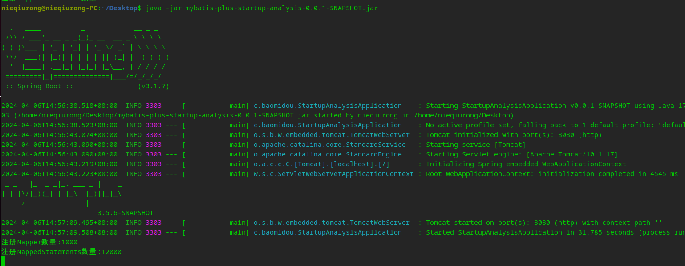
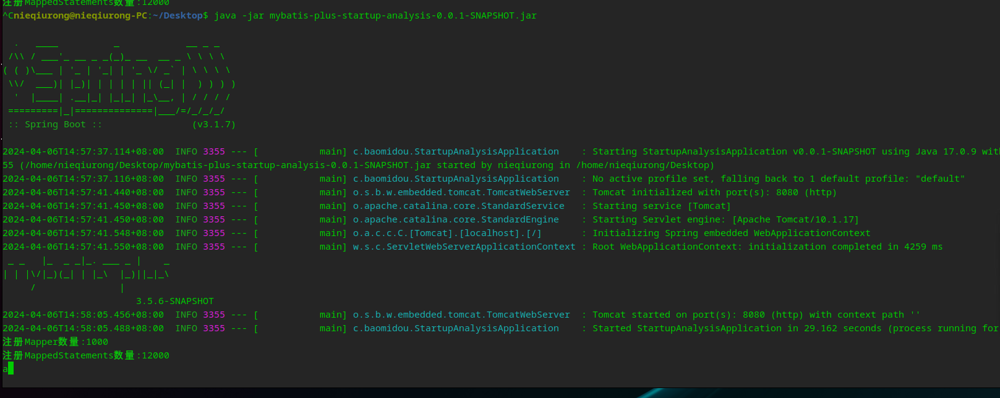
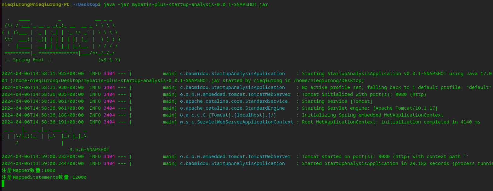

1000张表, 注入1000 * 12(内置方法)  并行注入启动 16秒 左右 (扫描 mapper)
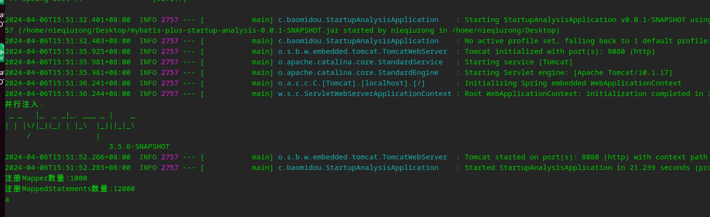
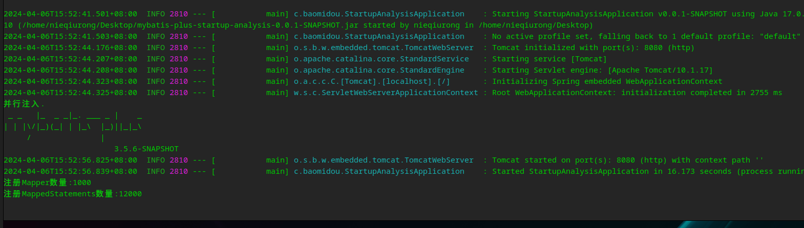
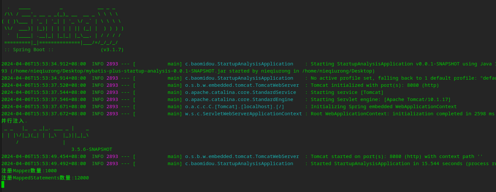
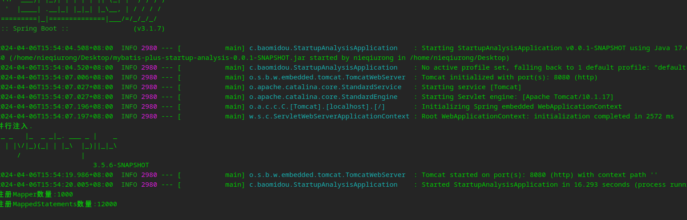

单纯的并行注入方法并不能带来太实际的性能提升，因为本身注入方法数量就少，如果能并行处理Mapper或者异步处理注入看能否提升部分启动速度，但综合来看, 中小型项目串行启动注入不会有太耗时的行为.